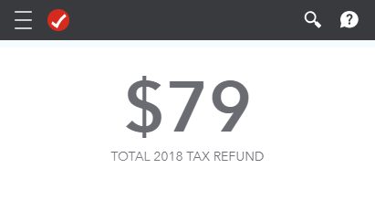

```{r setup, include=FALSE}
knitr::opts_chunk$set(echo = TRUE)
library(tidyverse)
library(ggplot2)
library(here)
library(ggmap)
library(maps)
library(mapdata)
library(stringr)
library(scales)
library(ggnewscale)
library(colorspace)
library(multiscales)
library(sf)
library(hexbin)
library(RColorBrewer)
library(reshape2)
library(readxl)
library(treemapify)

source("../../theme.R")

windows.options(antialias = "cleartype")
# options(device = Cairo::CairoSVG)

knitr::opts_chunk$set(fig.width=10, fig.height=6, fig.align = "center") 
# knitr::opts_chunk$set(fig.width=10, fig.height=7, dev = "svg") 
```

```{r import-acs17-data, message=FALSE, warning=FALSE, include=FALSE}
states_sf = read_sf(here("Datasets", "States_Shapefile", "cb_2017_us_state_20m.shx")) %>% filter(as.numeric(STATEFP) %in% c(1:56)[-c(2,15)])

us_sf = read_sf(here("Datasets", "US_Shapefile", "tl_2018_us_county.shx")) %>% filter(as.numeric(STATEFP) %in% c(1:56)[-c(2,15)])
# Oglala Lakota County, SD was Shannon County before 2015, which needs to be corrected, as apparently this area database ("LND01.xls") has not been updated since the name change
land_area = read_excel(here("Datasets", "LND01.xls")) %>% select(STCOU, LND110210D)
land_area[land_area$STCOU == 46113,]$STCOU = 46102
acs_17 = land_area %>% rename(GEOID = STCOU, land_area = LND110210D) %>% right_join(readRDS(here("Datasets", "acs_17_vals.rds"))) %>% inner_join(as_tibble(us_sf)[,c(4,16,17)], by = "GEOID")

unmodified_vars = c(1, 2, 3, 21, 22, 23, 32, 35, 36)
acs_17_mod = acs_17[1:length(acs_17[[1]]), unmodified_vars] %>%
  bind_cols(tibble(pop_dens = unlist((acs_17$total_pop / acs_17[,2])))) %>%
  bind_cols(as_tibble(acs_17[, -unmodified_vars] / acs_17$total_pop)) %>%
  rename("avg_fam_inc" = aggr_fam_inc) %>%
  separate(NAME, c("county", "state"), sep = ", ")

state_regions = state.fips[!duplicated(state.fips[c(4,5)]),c(4,5)] %>% 
  bind_rows(tibble(division = c(9, 9), abb = c("AK", "HI")))
state_regions$division = state_regions$division  %>% factor()
levels(state_regions$division) = list(Northeast = c(1,2), Midwest = c(3, 4), South = c(5, 6, 7), West = c(8, 9))

acs_17_mod = left_join(acs_17_mod, read_csv(here("Datasets", "state_abbr.csv")))

acs_17_mod = left_join(acs_17_mod, tibble(region = state_regions$division, abbr = state_regions$abb))

acs_17_mod$INTPTLON = -as.numeric(substr(acs_17_mod$INTPTLON, start = 2, stop = 11))
acs_17_mod$INTPTLAT = as.numeric(substr(acs_17_mod$INTPTLAT, start = 2, stop = 11))
acs_17_mod = acs_17_mod %>% st_as_sf(coords = c("INTPTLON", "INTPTLAT"), crs = 4326)

transformed_points = acs_17_mod$geometry %>% st_transform(crs = 102003)
acs_17_mod = cbind(acs_17_mod, st_coordinates(transformed_points))

acs_17_mod = acs_17_mod[rev(order(acs_17_mod$pop_dens)),]
```

```{r ubs-setup, include=FALSE, cache=TRUE}
urban_bb = read_csv2(here("Datasets", "US_Urban_Rate_Broadband_Survey.csv"))
urban_bb$`Total Charge` = round(as.numeric(urban_bb$`Total Charge`))
urban_bb$`Download Bandwidth Mbps` = round(as.numeric(urban_bb$`Download Bandwidth Mbps`))
urban_bb$isp_size = -log(as.numeric(urban_bb$Weight))
urban_bb$isp_size = (urban_bb$isp_size - min(urban_bb$isp_size) + 1)^3


perc_not_bb = sum(urban_bb$`Download Bandwidth Mbps` < 25) / length(urban_bb$`Download Bandwidth Mbps`) * 100

urban_bb$Provider = recode(urban_bb$Provider,
                           `Charter Communications, Inc.` = "Charter", 
                             `Charter Communications` = "Charter", 
                             `COMCAST CABLE COMMUNICATIONS, INC.` = "Comcast",
                             `COMCAST CABLE COMMUNICATIONS, LLC` = "Comcast",
                             `Cox Communications` = "Cox",
                             `Cox Communications, Inc` = "Cox",
                             `DigitalPath, Inc` = "DigitalPath",
                             `DigitalPath, Inc.` = "DigitalPath",
                             `Frontier Communications` = "Frontier",
                             `Frontier Communications Corporation` = "Frontier",
                             `Giggle Fiber LLC` = "Google Fiber",
                             `Google Fiber Kansas, LLC` = "Google Fiber",
                             `Google Fiber Missouri, LLC` = "Google Fiber",
                             `Google Fiber Texas, LLC` = "Google Fiber",
                             `Google Fiber Utah, LLC` = "Google Fiber",
                             `Knology of Alabama, Inc.` = "Knology",
                             `Knology of Florida, Inc.` = "Knology",
                             `Liberty Cablevision of Puerto Rico LLC` = "Liberty Cablevision",
                             `Liberty Cablevision of Puerto Rico, LLC` = "Liberty Cablevision",
                             `Mediacom Arizona LLC` = "Mediacom",
                             `Mediacom California LLC` = "Mediacom",
                             `Mediacom Delaware LLC` = "Mediacom",
                             `Mediacom Illinois LLC` = "Mediacom",
                             `Mediacom Indiana LLC` = "Mediacom",
                             `Mediacom Iowa LLC` = "Mediacom",
                             `Mediacom Minnesota LLC` = "Mediacom",
                             `Mediacom Southeast LLC` = "Mediacom",
                             `Orlando Telephone Company, Inc.` = "Orlando Telephone Company",
                             `RCN Telecom Services (Lehigh) LLC` = "RCN",
                             `RCN Telecom Services of Illinois, LLC` = "RCN",
                             `RCN Telecom Services of New York, LP` = "RCN",
                             `RCN Telecom Services of Philadelphia LLC` = "RCN",
                             `RCN Telecom Services of Philadelphia, LLC` = "RCN",
                             `Time Warner Cable Enterprises LLC` = "Time Warner",
                             `Time Warner Cable Inc.` = "Time Warner",
                             `Verizon California Inc.` = "Verizon",
                             `Verizon Delaware LLC` = "Verizon",
                             `Verizon Florida LLC` = "Verizon",
                             `Verizon Maryland LLC` = "Verizon",
                             `Verizon New England Inc.` = "Verizon",
                             `Verizon New Jersey Inc.` = "Verizon",
                             `Verizon New York Inc.` = "Verizon",
                             `Verizon Pennsylvania Inc.` = "Verizon",
                             `Verizon Pennsylvania LLC` = "Verizon",
                             `Verizon Virginia Inc.` = "Verizon",
                             `Verizon Virginia LLC` = "Verizon",
                             `Verizon Washington, DC Inc.` = "Verizon",
                             `Windstream Concord Telephone, Inc` = "Windstream",
                             `Windstream Corporation` = "Windstream",
                             `Windstream D&E, Inc.` = "Windstream",
                             `Windstream Georgia Communications, LLC` = "Windstream",
                             `Windstream Kentucky East, LLC` = "Windstream",
                             `Windstream Mississippi, LLC` = "Windstream",
                             `Windstream Missouri, Inc.` = "Windstream",
                             `Windstream Nebraska, Inc.` = "Windstream",
                             `Windstream North Carolina, LLC` = "Windstream",
                             `Windstream Ohio, Inc.` = "Windstream",
                             `Windstream Pennsylvania, LLC` = "Windstream",
                             `Windstream South Carolina, LLC` = "Windstream",
                             `Windstream Sugar Land, Inc` = "Windstream",
                             `Windstream Western Reserve, Inc` = "Windstream",
                           `AT&T Services, Inc.` = "AT&T", 
                           `CenturyLink, Inc.` = "CenturyLink"
         )
urban_bb$down_value = urban_bb$`Download Bandwidth Mbps` / urban_bb$`Total Charge`

agg_urban_bb = NULL

for (type in unique(urban_bb$Technology)) {
  agg_func = function(x) {
    return(mean(as.numeric(x)))
  }
  
  temp = subset(urban_bb, Technology == type) %>% subset(`Total Charge` > 0)
  result = temp %>% .[c(4,6,7,8,9,10,11,12,13,17,18)] %>% 
  aggregate(by = list(temp$Provider), FUN = agg_func) %>% 
    bind_cols(tibble(counts = table(temp$Provider)))
  result$Technology = type
  if (is.null(agg_urban_bb)) {
    agg_urban_bb = result
  } else {
    agg_urban_bb = bind_rows(agg_urban_bb, result)
  }
}

agg_urban_bb = subset(agg_urban_bb, Technology != "Other")
```

## The Internet is pretty important
 


## The Internet is pretty important
 

## The Internet is pretty important
 
 

## The Internet is pretty important
 
 

## The Internet is pretty important
 
 

## ...but it isn't distributed equally

```{r us-map-int, echo=FALSE, message=FALSE, warning=FALSE, cache=TRUE}
sum_us_int = sum(acs_17_mod$total_pop * acs_17_mod$no_inet)
avg_us_int = 1 - (sum_us_int / sum(sum(acs_17_mod$total_pop)))

states_sf %>% 
  ggplot() + 
  geom_sf(color = "grey90", fill = "white") +
  coord_sf(crs = st_crs(102003)) +
  geom_point(data = acs_17_mod, aes(x = X,
                     y = Y,
                     color = (1- no_inet),
                     size = pop_dens)) + 
  scale_color_gradientn(colors = color_pal(6, type = "cool"), labels = percent_format(accuracy = 1)) +
  scale_size(range = c(1, 15), breaks = c(50, 500, 5000, 50000)) +
  scale_alpha(range = c(1.0, 0.05)) +
  labs(title = paste(round(avg_us_int * 100), "% of America has Internet Access", sep = ""),
      color = "Percent with \nInternet",
       size = "Population Density \n(ppl/sq mi)",
      caption = "American Community Survey 2017") +
   theme_map() +
  theme(axis.text = element_blank())
```

## ...but it isn't distributed equally
```{r us-map-bb, echo=FALSE, message=FALSE, warning=FALSE, cache=TRUE}
sum_us_bb = sum(acs_17_mod$total_pop) - sum(acs_17_mod$total_pop * acs_17_mod$broadband_any)
avg_us_bb = (sum_us_bb / sum(sum(acs_17_mod$total_pop)))

states_sf %>% 
  ggplot() + 
  geom_sf(color = "grey30", fill = "#323232") +
  coord_sf(crs = st_crs(102003)) +
  geom_point(data = acs_17_mod, aes(x = X,
                     y = Y,
                     color = broadband_any,
                     size = pop_dens)) + 
  scale_color_gradientn(colors = color_pal(5, type = "warm", reverse = TRUE), labels = percent_format(accuracy = 1)) +
  scale_size(range = c(1, 15), breaks = c(50, 500, 5000, 50000)) +
  scale_alpha(range = c(1.0, 0.05)) +
  labs(title = paste(round(avg_us_bb * 100), "% of America has Broadband Access", sep = ""),
      color = "Percent with \nBroadband",
       size = "Population Density \n(ppl/sq mi)",
      caption = "American Community Survey 2017") +
  theme_map() +
  theme(axis.text = element_blank())
```

## This has serious implications

```{r point-int-pov, echo=FALSE, message=FALSE, warning=FALSE, cache=TRUE}
chart_labels = acs_17_mod[order(-acs_17_mod$total_pop)[1:10], c(3, 28, 11, 38)] %>% as_tibble()
names(chart_labels) = c("text", "x", "y", "region", "geometry")
chart_labels = chart_labels[order(-chart_labels$y),]
chart_labels$x = chart_labels$x * 100 + c(2, 3, 2, -1.25, -1, 3, 1, -1, 1.25, -0.75)
chart_labels$y = chart_labels$y * 100 + c(2, 1.5, 0, 3, 7, -1, -2.5, 1, -1.75, 0)
  
ggplot(data = acs_17_mod[sample(1:length(acs_17_mod$GEOID), length(acs_17_mod$GEOID)),], aes(x = no_inet * 100, y = below_poverty * 100)) + 
  geom_point(color = "grey", alpha = 0.2, size = 2) + 
  geom_label(data = chart_labels, aes(x = x, y = y, label = text, color = region), family = "Pragati Narrow", fontface = "bold", size = 4) +
  geom_point(data = acs_17_mod[order(-acs_17_mod$total_pop)[1:10], ], aes(color = region), alpha = 0.8, size = 3) +
  scale_fill_manual(values = color_pal(4)) +
  scale_color_manual(values = color_pal(4)) +
  labs(title = "Counties with Higher Poverty Rates Have Less Internet Access",
       x = "Percent Without Internet", 
       y = "Percent Below Poverty Line", 
       caption="American Community Survey 2017", 
       color = "Region") + 
  scale_x_log10(breaks = c(0, 1, 2, 5, 10, 15, 20, 25)) +
  scale_y_log10(breaks = c(0, 5, 10, 15, 20, 30, 40, 50)) +
  theme_master()  +
  theme(panel.grid.minor = element_blank())
```

## ...but there is some good news!
```{r speed-violin-plot, fig.width=6.25, echo=FALSE, message=FALSE, warning=FALSE, cache=TRUE}
chart_labels = tibble(text = c('FCC \nBroadband \nCutoff'), x = c(0.6), y = c(25))
ggplot(data = bind_rows(filter(urban_bb, Year == 2015), filter(urban_bb, Year == 2018)), aes(x = factor(`Year`), y = `Download Bandwidth Mbps`)) +
  geom_violin(aes(color = ordered(Year), fill = ordered(Year))) +
  scale_color_manual(values = color_pal(2)) +
  scale_fill_manual(values = color_pal(2)) +
  scale_y_continuous(trans = "log10", breaks = c(1, 5, 20, 50, 100, 300, 1000, 10000)) +
  geom_hline(yintercept = 25, linetype = 2,  color = "black", size = 1) + 
  geom_label(data = chart_labels[1,], aes(x = x, y = y, label = text), alpha = 0.95) + 
  labs(title = "Download Speeds Have Increased Significantly",
       x = "Year",
       fill = "Year",
       color = "Year",
       y = "Download Speed (Mbps)",
       caption = "Urban Rate Broadband Survey") +
  theme_master() +
  theme(legend.position="none") + 
  theme(panel.grid.minor = element_blank())
```

## ...but there is some good news!
```{r tech-dist, echo=FALSE, message=FALSE, warning=FALSE, cache=TRUE}
chart_labels = tibble(text = c("Cable", "DSL", "Fixed wireless", "FTTH", "Other"), x = rep(c(2016), times = 5), y = c(0.47, 0.27, 0.16, 0.07, 0.00))

get_perc = function(data_set, category, n_var) {
  len = length(data_set[[1]])
  for (i in 1:len) {
    data_set$percent[i] = eval(parse(text = paste("data_set$", n_var, "[i] / sum(subset(data_set,", 
                                                 category, "== data_set$", 
                                                 category, "[i])$", 
                                                 n_var, 
                                                 ")",
                                                 sep = "")))
    
  }
  return(data_set)
}

urban_bb[c(2,5)] %>% table() %>% as_tibble() %>% get_perc("Year", "n") %>%
  ggplot(aes(x = as.numeric(Year), color = Technology, y = as.numeric(percent))) + 
  scale_color_manual(values = color_pal(5)) +
  geom_line(size = 1.5) + geom_point(size = 2) +
  geom_label(data = chart_labels, aes(x = x, y = y, label = text), color = color_pal(5), family = "Pragati Narrow", fontface = "bold", size = 6) +
  labs(title = "More People are Choosing Fiber to the Home",
       x = "Year", 
       y = "Percentage of Respondents",
       caption = "Urban Rate Broadband Survey") +
  scale_y_continuous(labels = scales::percent_format(accuracy = 1), breaks = c(0, 0.1, 0.2, 0.3, 0.4, 0.5)) +
  theme_master() + 
  hide_legend + 
  theme(panel.grid.minor.x = element_blank())
```

## ...but there is some good news!
```{r tree-map, echo=FALSE, message=FALSE, warning=FALSE}
ggplot(agg_urban_bb, aes(area = as.numeric(counts), fill = down_value, label = Group.1, subgroup = Technology)) + 
  geom_treemap() +
  geom_treemap_subgroup_border() +
  geom_treemap_subgroup_text(place = "centre", grow = T, alpha = 0.5, colour =
                             "black", fontface = "italic", min.size = 0) +
  geom_treemap_text(colour = "white", place = "centre",
                    grow = TRUE) +
  scale_fill_gradientn(trans = "log10", colors = color_pal(5, type = "continuous")) + 
  labs(title = "Cable and Fiber ISPs Provide Better Value for Internet Service",
       fill = "Value \n(Megabits \nper USD)", 
       caption = "Urban Rate Broadband Survey") +
  theme_master()
```

## Interative Visualization
[https://tonofshell.me/us-broadband-interactive/](https://tonofshell.me/us-broadband-interactive/)